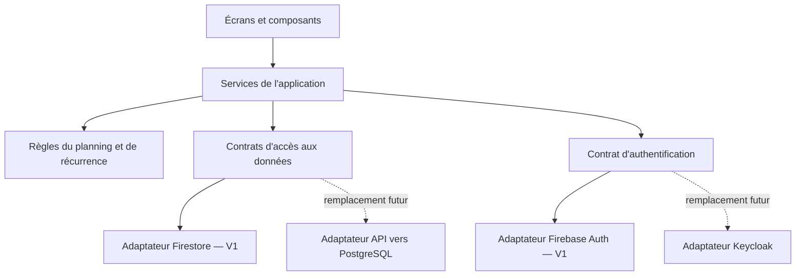

# Architecture et migration de la base et de l'authentification

Document de conception — 5 octobre 2026. La première implémentation comprend les écrans, le domaine, les services, l'adaptateur Firebase et la démonstration locale. Le backend réel et les gestes dans le navigateur restent à vérifier lors de la configuration et de l'essai.

## Choix actuel

La V1 conserve GitHub Pages pour l'interface, Firebase Authentication pour la connexion et Cloud Firestore pour les données. Le forfait Firebase Spark et la contrainte de coût nul restent applicables.

La cible future est la solution de l'utilisateur avec PostgreSQL et Keycloak. Supabase peut être envisagé ultérieurement, mais ne remplace pas Firebase dans le périmètre actuel. Aucun service supplémentaire n'est déployé pour préparer cette migration.

L'objectif est une migration simple : nouvelles implémentations des contrats, changement de configuration et reprise des données / comptes, sans refonte des écrans ni des règles métier. Les contrats et le format d'export seront documentés et versionnés dès la V1. La préparation doit rester proportionnée : implémenter Firebase et un adaptateur de test suffit aujourd'hui ; construire tous les futurs backends n'est pas nécessaire.

## Séparation des responsabilités

Les écrans appellent les services de l'application. Les règles de répétition, de regroupement en séances et de comptage ne connaissent ni Firebase, ni Supabase, ni Keycloak. Un point d'initialisation assemble les services avec les adaptateurs retenus.

Les dépendances propres au fournisseur restent dans les adaptateurs. L'interface reçoit des modèles et des erreurs définis par l'application, pas les objets de session ou les documents bruts du SDK.

## Services proposés

| Service | Responsabilité |
| --- | --- |
| AuthService | Connexion, déconnexion, état de session et utilisateur normalisé |
| HouseholdService | Foyer, membres et correspondance avec les comptes connectés |
| TaskService | Catalogue, pièces, fréquences et modèles de séance |
| PlanningService | Occurrences, reports, affectations, checklists et récapitulatifs |
| ExportService | Export / import métier versionné, avec contrôle de cohérence |

Les interfaces de persistance permettent de charger une période, enregistrer une modification et recevoir les mises à jour du foyer. Une éventuelle souscription retourne une fonction de désabonnement, sans exposer d'objet Firebase. Un futur adaptateur pourra utiliser les événements de son backend ou un rechargement périodique.

Les écritures touchant plusieurs actions, comme déplacer une séance, doivent conserver leur cohérence. Les contrats expriment cette opération métier ; chaque adaptateur choisit sa transaction et son mécanisme de détection des modifications concurrentes.

## Modèles indépendants du fournisseur

- Identifiants métier stables générés par l'application, par exemple des UUID.
- Relations exprimées par des identifiants : foyer, membre, groupe, tâche, séance et occurrence.
- Date du planning au format `YYYY-MM-DD`, sans conversion en instant UTC.
- Instants de création, modification et réalisation sous forme normalisée ; conversion des timestamps Firestore à la frontière de l'adaptateur.
- Répétition décrite explicitement : unité, intervalle, date d'ancrage et éventuelles exceptions.
- Statuts et erreurs propres à l'application : à faire, fait, accès refusé, indisponible, conflit, données invalides.
- Versions de schéma et des entités pour les migrations et le contrôle de concurrence.

Pour la V1, les documents Firestore stockent ces entités et leurs relations. Le futur schéma SQL pourra reprendre les mêmes identifiants et exprimer les relations par des clés étrangères. Il faudra définir et vérifier le schéma PostgreSQL lors de la migration.

## Membres et identités de connexion

Le membre métier a son propre identifiant. Une association séparée relie ce membre à une identité de connexion : fournisseur, émetteur et identifiant externe. Les tâches référencent le membre métier, plutôt que l'identifiant Firebase.

Un compte reconnecté via Keycloak retrouvera ainsi ses affectations après création et vérification de cette association. Ne pas rattacher automatiquement des comptes sur la seule base d'une adresse email non vérifiée. Un membre préparé dans le foyer peut rester sans compte lié jusqu'à son rattachement autorisé.

Le service de session expose l'état connecté et le profil nécessaire à l'application. L'adaptateur d'authentification et l'adaptateur de données gèrent les justificatifs d'accès ; les écrans ne stockent ni ne manipulent de jetons d'accès.

## Autorisations

En V1, les règles Firestore vérifient l'identité connectée et son appartenance au foyer pour chaque accès. L'interface utilise les droits pour afficher les actions disponibles, mais le backend reste l'autorité.

Pour la cible auto-hébergée, prévoir une API HTTPS entre le navigateur et PostgreSQL. Cette API vérifiera les justificatifs de connexion Keycloak et les droits du foyer. Aucune connexion SQL ni aucun mot de passe PostgreSQL ne sera exposé dans le site GitHub Pages.

Si Supabase est choisi à une étape ultérieure, l'accès aux données et à l'authentification passera également par ses adaptateurs dédiés ; les droits devront être appliqués dans le backend choisi.

## Export et trajectoire de migration

L'export métier couvre le catalogue, les pièces et leurs couleurs, les foyers et membres autorisés, les séries, les séances, les occurrences, les exceptions et l'historique. Il contient un numéro de version et des identifiants cohérents. Les données exportées sont limitées au périmètre auquel l'utilisateur a accès.

L'export de l'application exclut les secrets, les jetons et les mots de passe. Une éventuelle migration administrative des comptes constitue une opération distincte de cet export. Firebase fournit des commandes d'export et d'import des comptes ; leur existence ne garantit pas la compatibilité avec le futur serveur d'identité. [Documentation Firebase Auth](https://firebase.google.com/docs/cli/auth).

Lorsque l'infrastructure cible sera prête :

1. Créer le schéma PostgreSQL et l'API, puis implémenter les adaptateurs de données et d'authentification.
2. Exporter un jeu représentatif depuis Firebase et convertir ses données en tables SQL.
3. Vérifier les relations, les fréquences, les reports, les réalisations, les couleurs et les affectations.
4. Créer ou rattacher les comptes Keycloak ; déterminer si une nouvelle connexion ou une réinitialisation des mots de passe est nécessaire.
5. Tester les droits avec au moins deux membres autorisés et un utilisateur extérieur au foyer.
6. Prévoir une courte suspension des modifications pour l'export final, l'import et le contrôle de cohérence.
7. Activer les nouveaux adaptateurs et vérifier le planning depuis téléphone et PC.
8. Conserver une sauvegarde et un plan de retour ; définir comment traiter les écritures reçues après la bascule avant tout retour vers Firebase.

La V1 implémente uniquement les adaptateurs Firebase. Les contrats et l'export préparent le changement ; les adaptateurs de la cible seront réalisés lorsqu'elle sera disponible.

## Validation de l'architecture

- Contrôler que les imports du SDK Firebase sont limités à son intégration.
- Tester les règles de répétition, de déplacement et de réalisation sans dépendance au fournisseur.
- Vérifier les contrats d'accès aux données et de session avec un adaptateur de test.
- Exécuter les mêmes scénarios de planification et de session avec cet adaptateur, en changeant uniquement leur initialisation, sans modifier les écrans ni les règles métier.
- Vérifier la cohérence d'un export et de sa réimportation.
- Tester les refus d'accès côté backend ; un filtre d'interface ne constitue pas ce test.

Références techniques : [types Firestore](https://firebase.google.com/docs/firestore/manage-data/data-types), [OpenID Connect avec Keycloak](https://www.keycloak.org/securing-apps/oidc-layers).
